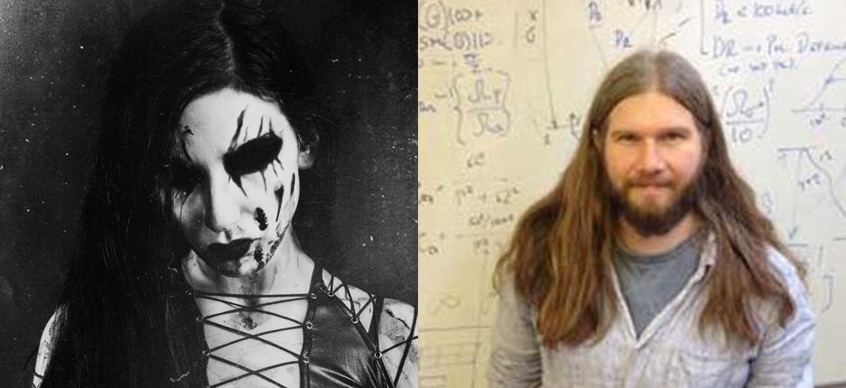

<html>
	<head>
		<title>Ana Sayfa</title>
		<link rel="stylesheet" type="text/css" href="BlogStyle.css">
		<link rel="icon" href="../coloricon.png">
	</head>
</html>
[< BLOG](https://caglayandemirci.github.io/Blog/MainPage)
   
# ALTERNATİF DÜNYA ÖZLEMİ
  
İnsanlar olarak mutsuzuz. Depresyon ve stres, her geçen gün daha da büyüyen kara bir siluet gibi karşımızda yükseliyor. Bilincimizin her gün tekrar ve tekrar bu bunalımları mazeret göstererek gerçekleştiremediği hayallerin çöp yığınları altında eziliyoruz. Bütün bu zayiata iyi gelecekmiş gibi dört elle sarıldığımız dokunmatik ekranlardan da, beyaz yakalı yaşamın ne kadar güzel bir şey olduğuna ya da sizin kendi kişiliğinizin başka insanların değer yargıları süzgecinden geçirilmesinin ne kadar önemli olduğuna dair pompalanan safsatalardan başka bir şey yansımıyor. 

Sürekli bir veri bombardımanı altında tutulıyoruz. Etrafımızda uçuşan sayısız veri var. Bu olay neredeyse sanayi devriminden beri gerçekleşiyor. Bugün kendini televizyonlar, telefonlarımız ve içindeki onlarca mesajlaşma grubu, her bir görseline birkaç saniye ayırarak sonu gelmez mizah açlığımızı doyurmaya çalıştığımız post siteleri, sosyal medya, bir sene olsun geleceği olmayan popüler bazı sanat öğeleri ve benzerleri şeklinde gösteriyor. Şekli değişse de olmaya devam edecek, içeriği çok önemli değil ama eskiye göre hızı olağanüstü ölçüde arttı. Sonucu olarak şunu söyleyeceğim ki, yanlız kalmayı unuttuk. Kafalarımız sakin değil. Mesleğimiz olmadıktan sonra konsantrasyon ve fedakarlık isteyen bir işe (sanata örneğin) zaman ayırmak istemiyoruz. Twitter gönderileri kadar kısa sürmüyor. Yirmibirinci yüzyıl insanları olarak, hızlı sonuca açız.

Mutsuzluk içinde koşturmacadan daha delice bir şey düşünemiyorum. Bir gün fantastik bir olayın gerçekleşmesi sonucunda bu modern karakterimiz kendini omzunda hiçbir sorumluluğun olmadığı lapa lapa kar yağmış devasa ve sessiz bir ormanın içinde bulacak ve kötü bloglardan okuyup durduğu aptal bir korku hikayesi canavarıyla karşılaşmayacağını anladığı anda bir an olsun sükuneti ve evrenin gücünü hissedip gözyaşlarına boğulacak. (ya da siz insanlığın ayak basmadığı beyaz kumlu bir sahil hayal edin, ben kendi cennetimi söyledim)

O günün gelmeyeceğini bildiğimize göre, oturduğumuz yerden kaçış şart. Benim kaçış noktalarımdan biri yıllardır, sert müzik ve onun yoğunluğunun hissettirdiği güç olmuştur. İcra edenlerin ya da benim gibi yüzbinlerce insanın hissettikleri de benzer olacak ki en sevdiğim grubun albümlerinden birinin adı Soundtrack To Your Escape’tir. Hiçbir zaman Rock müziği ergenlik yaşında olmanın ittiği tarz arama çabasının bir sonucu olarak görmedim. Böyle görenleri de hiç ama hiç anlamıyorum. Bugün bir yanda İran’dan, onca baskı ve imkansızlığın arasında duygularını coşku gözyaşları içinde dışa vurmak için Avrupa’daki festivallere birkaç günlük olsun uçaklar dolusu kaçan insanlar var; diğer bir yanda geçtiğimiz beş yılın en şişirilmiş popüler müzik öğesi olarak Justin Bieber var iken, insanların metal lafını duyduğunda “gençken özendikleri bir şey işte” sözünü nasıl söyleyebildikleri ilginç bir durum. İşini gücünü eline almış, beyaz gömlek ve kısa saçlar altında da bu müziği dinleyen onbinlerce insan olması ve diğerlerinin bunu bilmemesi bir ilüzyon yaratıyor olabilir. 

   

Aradaki 7 farkı bulunuz: Soldaki kimilerinin kafasındaki metalci imajı. Sağdaki de son yıllardaki gururlarımızdan biri Mete Atatüre, Cambridge Üniversitesi’nde fizik profesörü. Kendisi Rock dinler.    

Rock örneğindeki kaçış öykümüz 1950'lerde Amerika'da başlar. Fabrikada karın tokluğuna çalışan siyahi işçi, acımasız baskı ve ekmek parası kazanmanın endişesinden başka bir şeyler yaşamak ister. Eline gitarı alır ve atalarından miras gelen Afrikalı hüznünün doğallığıyla birleştirerek havalandırdığı batılı ezgisi, bugün rockçılar olarak dünyanın en güzel müziklerinden biri olarak nitelendirdiğimiz Blues olarak karşımıza çıkar. Bu müziğin doğrudan oğlu olan Rock'n Roll 1960'larda ABD ve İngiltere'de gelişir. 1970'lere gelindiğinde Rock, İngiliz sanatçılığıyla güzelleşip gelişmiş ve bir o kadar da çığırından çıkmıştır. Müzisyenin alternatif bir dünyaya özlemi, her şeyi bir an için olsun ardında bırakıp güzel ve güçlü bir sanata kaçma güdüsü o denli artmıştır ki, onun icra ettiği müziği onu doğrudan yaşamak isteyen gençler dışında kimse tarafından dinlenmek istemez. Dahası bazı kesimlerce sapkınlık olarak değerlendirilmeye başlamıştır. Bugün o çığırından çıkmışlığa Heavy Metal, ya da dallanıp budaklanmış daha geniş sınıfına kısaca Metal diyoruz. 

Kaçışımız sonucunda varabildiğimiz ikinci bir alternatif dünya, fantastik sanatlardır. Bu sanat kaçışa öyle iyi bir örnektir ki, 
