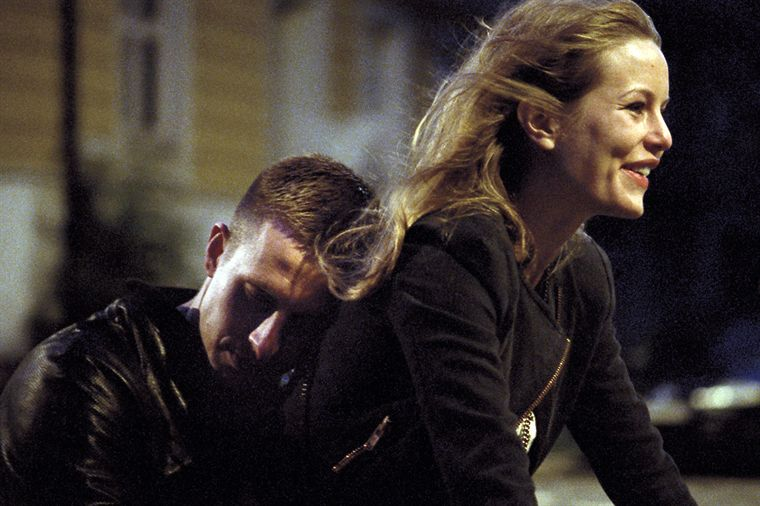

<html><head><link rel="icon" href="../coloricon.png"></head></html>
[`< BLOG`](https://caglayandemirci.github.io/Blog/MainPage)
   

   
## OSLO 31. AUGUST
  

İskandinav sinemasında çok güzel eserler var. Yaptıkları filmler de ülkeleri gibi: kaliteli, çok güzel, refahtan sonra gelen ve kimilerinin “rahat batması” olarak tanımladığı fakat insanevladının yaşayacağı en doğallarından olan sorunların başgösterdiği yapıtlar (‘soğuk’ demediğim için özgünlük madalyamı alayım lütfen). Belki bir ara “İskandinav Sinemasından On Seçki” tarzında bir yazı yazabilirim buraya.

Benim için ayrı yeri olan İskandinav filmlerinden biri. Cannes ve İstanbul’da gösterilmiş ve bir yerlerde Jüri Özel Ödülü almış Ekşi’den öğrendiğime göre. Sinemanın bu kısmı hakkında çok bilgim yok ama oyunculuğun ve yönetmenliğin çok başarılı olduğunu benim de hissettiğimi söylemeliyim. IMDB: 7.6

Bir de Onedio denen saçma yerde bunun özetini şuna benzer bir şekilde okumuştum: “Uyuşturucu bağımlısı Anders bir iş görüşmesine gitmek için bir günlüğüne rehabilitasyon merkezinden salınmıştır. Ancak Anders’in başka planları vardır.” Hadi ya? Bu tanım, bu filmi kesinlikle anlamamış birinin kuracağı bir cümleden ibaret. Varoluş krizini dibine kadar hissedip, çaresizlik içinde bir yol bulup bulamayacağının kaygısını hisseden birinin, dışarı çıkma fırsatını bulduğu an alem yapmaya devam edecek bir serseri gibi anlaşılması tam da bu adamlara yakışacak bir bakış açısı.

Gerisi, çok da spoiler değil; şimdiye kadar ilginizi çekmediyse devam edin. 

***

Bu film hakkında her yerde görebileceğiniz tanım, “Uyuşturucu bağımlısı Anders’in yaşadıkları” şeklinde olacaktır. Bilemem, uyuşturucu kullanmadım; ben bu filmi izlerken onun depresyon hakkında bir film olduğunu gördüm. 

Bu, teslimiyetin öyküsü. Duygu kaybı yaşamanın, hiçbir şeyin özünü eskisi gibi hissedemiyor olmanın, bundan sonra da hissedebileceğini sanmayan birinin hikayesi. Ailesine, ya da bir zamanlar değer verdiği veya bir şekilde anılar yaşadığı insanlara gidip, olası intiharında onların bir suçu olmadığını anlatmaya çabalayan birinin krizi. Sevgi isteyen bir insanın; kaybetmişliğinin acısını, varoluşunun farkında olmuş insanlara gidip oralarda kendi yerini görmek isteyerek dindirmeye çalışan bir insanın biyografi filmi bu. Akıllılığına ve belki onca donanımına rağmen 34 yaşında elinde somut bir şeyler göremeyen ve bunun bir ‘sil baştan’ı olmadığının farkına acıyla varmış olan birinin. Bunları anlamayan biri tarafından izlendiğinde bu filmden çıkarılabilecek tek ders uyuşturucunun ne kadar kötü bir şey olduğudur. Gerisi düpedüz sıkıcılık ve kuzeyli karamsarlığıdır. Ha, Oslo çok güzel görünüyor o ayrı. Ağaçlar falan. 

Vurucu filmleri seviyorum. Bu da onlardan biriydi. Kimisine karamsar ve aksiyon olmayan filmleri izletmeye kalktığınızda sıkıntıdan patlar. Bu tip “mutlu aptallardan” (vallahi sizi suçlamıyorum, filmdeki bir gönderme bu :) ) değilseniz, bir bakın derim.
   
http://3.bp.blogspot.com/-eiNEhwQGOWQ/T4fiUrNnX_I/AAAAAAAAAig/X8UNJ1WhG1k/s1600/oslo31august2.jpg 
https://s-media-cache-ak0.pinimg.com/originals/ec/04/e1/ec04e1fb074adb9284144dfda383bd3f.jpg 
http://68.media.tumblr.com/024822a30baeda911773add02d670cb3/tumblr_o6ogzkuZ0X1v4a8wfo2_1280.png 
https://c1.staticflickr.com/9/8285/7588625126_ab74a50aab_b.jpg 
https://3.bp.blogspot.com/-DMzEKevKGzw/VeVGaDFZrqI/AAAAAAAAL98/lYDX_KUVVWU/s1600/vlcsnap-2015-09-01-01h19m27s28.png 
   
  
 
