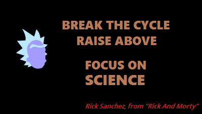

<html>
	<head>
		<link rel="stylesheet" type="text/css" href="CSStyle.css">
		<link rel="icon" href="../coloricon.png">
		<link rel="stylesheet" href="../sunburst.css">
		
	</head>
	  
</html>
  

## BİLGİSAYAR BİLİMLERİ      
<a class="topLink" href="https://caglayandemirci.github.io">&lt;- Ana Sayfa<a> &nbsp;&emsp; <a class="topLink" href="https://caglayandemirci.github.io/CS/MainPge">&lt;&lt;- Bilgisayar Bixlimleri Ana Sayfası<a>

   
### SON YAZILAR  

[Temel C ile Queue Programlama - 4.3.2017](https://caglayandemirci.github.io/CS/CProgramming)

