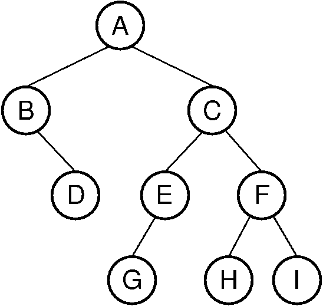

# Some Pseudocodes On Tree Structure

Traversals on a given binary tree similar to below:



### Preorder Traversal:

```
function binaryPreorder(Tree t, Node v):
	visit(v)
    if v.hasLeft()
    	binaryPreorder(T, v.left())
    if v.hasRight()
    	binaryPreorder(T, v.right())    
```

Output: **A, B, D, C, E, G, F, H, I**

### Postorder Traversal:

```
function binaryPostorder(Tree t, Node v):
    if v.hasLeft()
    	binaryPostorder(T, v.left())
    if v.hasRight()
    	binaryPostorder(T, v.right())    
    visit(v)
```

Output: **D, B, G, E, H, I, F, C, A**

### Inorder Traversal:

```
function binaryInorder(Tree t, Node v):
    if v.hasLeft()
    	binaryInorder(T, v.left())
    visit(v)
    if v.hasRight()
    	binaryInorder(T, v.right())    
```

Output: **D, B, A, G, E, C, H, F, I**

***

Finding the lowest common ancestor of two given nodes v1 and v2:

```
function lowestCommonAncestor(v1, v2):
	d1 = v1.depth
    d2 = v2.depth
    <assume d1 is max>
    while d1 > d2
    	v2 = v2.parent
    while v1 != v2
    	v1 = v1.parent
        v2 = v2.parent
```
