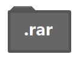

#### Change Log

25.11.2018 (3) - Main page link added to top of subpage layout.

25.11.2018 (2) - Website logo which is Snowflake in a Black Square relocated on the header instead of simple black hexagon.

25.11.2018 (1) - Old directory representation images made pixelation. New directory images have been drawned and added.

20.11.2018 - Safari had ignored default Consolas font type in code blocks. So code blocks fonts supported by another .ttf file contains Source Code Pro Regular font. 

---

Changes before November 20 2018 were not written.